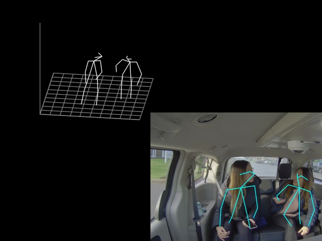

# 3d Human Pose Estimation Python* Demo

This demo demonstrates how to run 3d Human Pose Estimation models using OpenVINO&trade;.

> **NOTE**: Only batch size of 1 is supported.
## How It Works

The demo application expects an 3d human pose estimation model in the Intermediate Representation (IR) format.

As input, the demo application can take:
* a path to a video file or a device node of a web-camera specified with a command line argument `--video`.
* a list of image paths specified with command line argument `--images`.

The demo workflow is the following:

1. The demo application reads video frames one by one and estimates 3d human poses in a given frame.
2. The app visualizes results of it work as graphical window with 2d poses, which overlaid on input image, and canvas with corresponding 3d poses.

> **NOTE**: By default, Open Model Zoo demos expect input with BGR channels order. If you trained your model to work with RGB order, you need to manually rearrange the default channels order in the demo application or reconvert your model using the Model Optimizer tool with `--reverse_input_channels` argument specified. For more information about the argument, refer to **When to Reverse Input Channels** section of [Converting a Model Using General Conversion Parameters](https://docs.openvinotoolkit.org/latest/_docs_MO_DG_prepare_model_convert_model_Converting_Model_General.html).
## Prerequisites

Before running it is necessary to build `pose_extractor` module. Your system should have installed:
* Python 3.5 (or above)
* CMake 3.10 (or above)
* C++ Compiler (g++ or MSVC)

To build `pose_extractor` module, please run in command line:
`python setup.py build_ext`
Then add build folder to `PYTHONPATH`:
`export PYTHONPATH=pose_extractor/build/:$PYTHONPATH`

## Running

Run the application with the `-h` option to see the following usage message:

```
usage: demo.py [-h] -m "<path>" [--video VIDEO] [-d "<path>"] [--use-pytorch]
               [--images IMAGES [IMAGES ...]] [--height-size HEIGHT_SIZE]
               [--extrinsics-path "<path>"] [--fx FX]

Lightweight 3d human pose estimation demo. Press esc to exit, "p" to (un)pause
video or process next image.

Options:
  -h, --help            Show this help message and exit.
  -m "<path>", --model "<path>"
                        Required. Path to an .xml file with a trained model
                        (or .pth in case of PyTorch inference).
  --video VIDEO         Optional. Path to video file or camera id.
  -d "<path>", --device "<path>"
                        Optional. Specify the target device to infer on: CPU,
                        GPU, FPGA, HDDL or MYRIAD. The demo will look for a
                        suitable plugin for device specified (by default, it
                        is CPU).
  --use-pytorch         Optional. Run network with PyTorch as inference
                        engine. Only CPU and GPU devices are supported.
  --images IMAGES [IMAGES ...]
                        Optional. Path to input image(s).
  --height-size HEIGHT_SIZE
                        Optional. Network input layer height size.
  --extrinsics-path "<path>"
                        Optional. Path to file with camera exstrinsics.
  --fx FX               Optional. Camera focal length.

```

Running the application with an empty list of options yields the short version of the usage message and an error message.

To run the demo, you can use public or pre-trained models. To download the pre-trained models, use the OpenVINO [Model Downloader](../../../tools/downloader/README.md) or go to [https://download.01.org/opencv/](https://download.01.org/opencv/). You also may run demo with PyTorch*, using pre-trained checkpoint: **TBD: ADD CHECKPOINT PATH on download.01.org**.

> **NOTE**: Before running the demo with a trained model, make sure the model is converted to the Inference Engine format (`*.xml` + `*.bin`) using the [Model Optimizer tool](https://docs.openvinotoolkit.org/latest/_docs_MO_DG_Deep_Learning_Model_Optimizer_DevGuide.html).
To run the demo, please provide paths to the model in the IR format, and to an input video or image(s):
```bash
python human_pose_estination_3d_demo.py \
-m /home/user/human-pose-estimation-3d-0001.xml \
-v /home/user/160422_ultimatum1_part.mp4
```

## Demo Output

The application uses OpenCV to display found poses and current inference performance.



## See Also
* [Using Open Model Zoo demos](../../README.md)
* [Model Optimizer](https://docs.openvinotoolkit.org/latest/_docs_MO_DG_Deep_Learning_Model_Optimizer_DevGuide.html)
* [Model Downloader](../../../tools/downloader/README.md)
